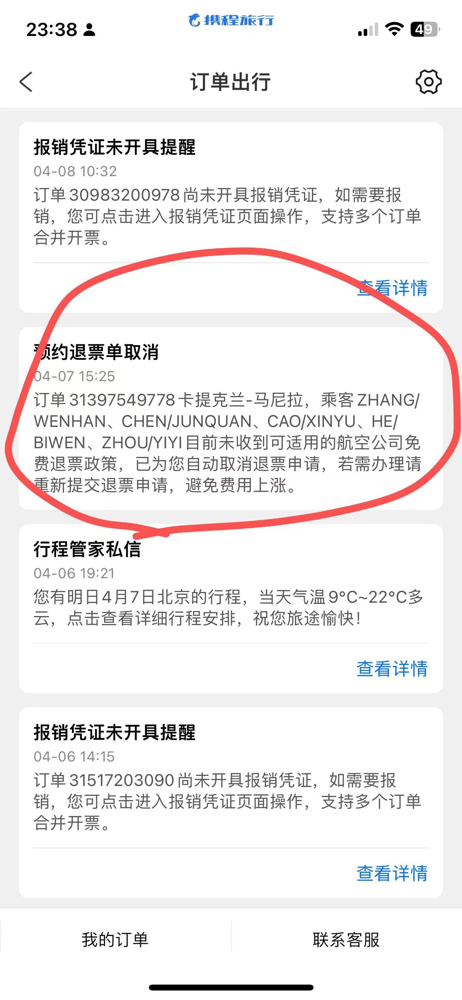
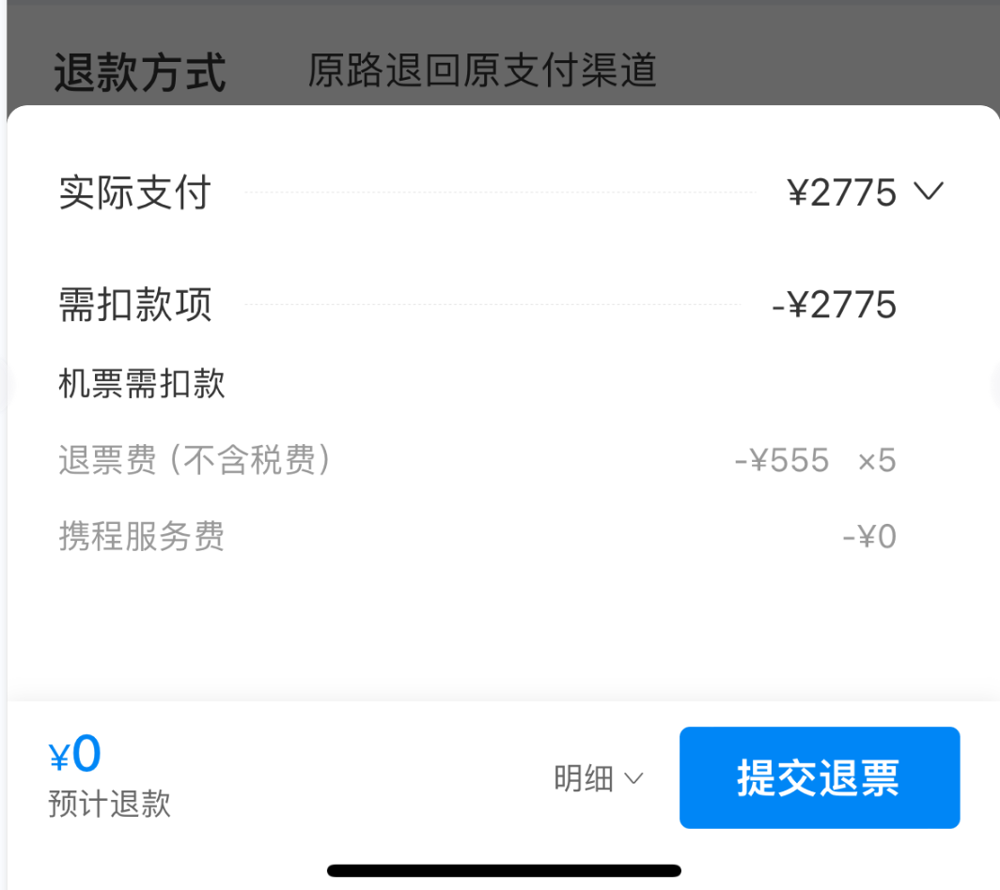
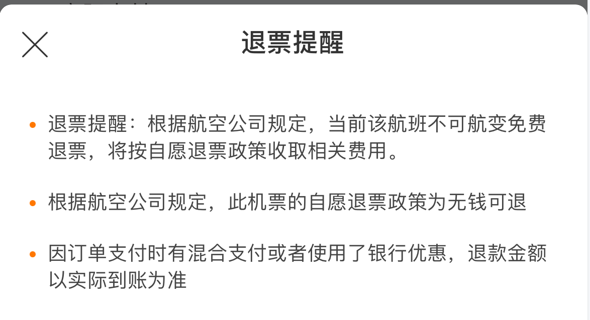

# 携程：可以退款，到账零元

## 事情原委：

我们的飞机提前飞走了

我们原定下午3：45的飞机，我们预计下午3:00到机场

飞机更改了起飞时间，提前到3:25起飞

下午3:00钟我们按照原本的计划到卡提克兰机场的，并且在值机台正常的出票了

结果机场地勤人员告诉我们飞机已经飞走了，并且告诉：

​			*飞机在起飞之前，已经在机场播报我们的姓名通知起飞了*

## 我们到了机场、飞机提前飞走证据：

#### 我们已经完成了线下值机，并且拿到了机票

#### 我们在机场拍了照片，相机iphone相机自带记录时间地点功能

#### 出候机厅后根据柜台服务人员口头表述，本架飞机登机截止时间为         下午3点05分，可以确认我们在规定时间内已到达登机口。

## 我们的维权路程：

### 携程app上自助申请退票

#### 我们申请退票

#### 携程消息提示

以**没有相关政策**为由，**拒绝退票**

*（订单31397549778卡提克兰-马尼拉，乘客ZHANGWENHAN、CHENJUNQUAN、CAO/XINYU、HE/BIWEN、ZHOUYIYI）*

*目前未收到可适用的航空公司免费退票政策，已为您自动取消退票申请。**

### 向携程人工客服提出投诉

#### 我们向人工客服的反馈：

*正常值机及安检。在安检前地勤扫描了登机牌上的二维码并让我们正常排队安检*
*宿务航空提前关闭舱门。我们在3点前已到达登机口，被告知已经停止登机后被赶出候机厅。*
*没有收到任一方的最新登机截止时间。携程应在得知最新的登机截止时间时尽快通知，携程没有做到。iv.出候机厅后根据柜台服务人员口头表述，本架飞机登机截止时间为下午3点05分，可以确认我们在规定时间内已到达登机日。*

#### 携程的反馈：

**否定飞机提前起飞或提前关闭舱门等行为**

甚至在软件上给出：可以退款，预计到账0元的嘲讽

